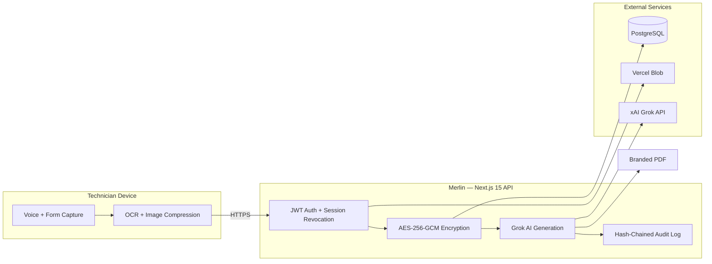

# Merlin — Mercedes-Benz Warranty Story Generator

**Secure AI-Powered Warranty Documentation Platform for Mercedes-Benz Dealerships**

[](https://nextjs.org/)
[](https://www.typescriptlang.org/)
[](https://www.prisma.io/)
[](https://github.com/Nicequantum/viti-ai-clone)

Merlin is a secure, dealership-specific platform that allows Mercedes-Benz technicians to create accurate, professional warranty narratives using Grok AI. It combines voice input, enterprise-grade security, and a complete audit trail to meet the standards of both individual dealerships and multi-location groups.

**Version:** 3.0.1 · **Prompt version:** 2.1.0 · **Status:** Production-ready for multi-dealership rollout

---

## Production Readiness Status

| Area | Status | Notes |
|------|--------|-------|
| **Audit trail** | ✅ Ready | SHA-256 hash chain + `promptVersion` on every AI entry |
| **Voice input** | ✅ Ready | Noise monitoring, push-to-talk, auto-restart, adaptive confidence |
| **AI story generation** | ✅ Ready | Centralized prompts v2.1.0, rate limits, daily caps |
| **PDF export** | ✅ Ready | Branded headers, structured content, audit hash in footer |
| **Security** | ✅ Ready | AES-256-GCM PII, CSP headers, route auth, input sanitization |
| **Operations** | ✅ Ready | Maintenance mode, offline banner, health/status endpoints, error boundaries |
| **Validation** | ✅ Ready | `npm run validate:env` + `npm run validate:pre-rollout` |
| **Documentation** | ✅ Ready | 12 rollout documents in [`docs/`](./docs/) — [full index](./docs/README.md) |
| **Dealership config** | ⚠️ Per site | Set `DEALERSHIP_DISPLAY_NAME`, secrets, and doc placeholders before go-live |
| **Screenshots** | ⚠️ Optional | Add `docs/images/*.png` before printing Technician Quick Start |
| **KV rate limiting** | ⚠️ Recommended | Configure `KV_REST_*` for distributed limits in serverless |

**Go-live gate:** `npm run validate:pre-rollout` with **0 critical failures** + [Go-Live Checklist](./docs/Go-Live-Checklist.md) signed off.

---

## Documentation — start here

> **Dealership leadership:** Start with the [**Master Rollout Document**](./docs/Master-Rollout-Document.md) — readable in under 10 minutes.

All rollout and go-live materials live in [`docs/`](./docs/). See the [**Documentation Library index**](./docs/README.md) for role-based navigation.

### By audience

| Audience | Primary document |
|----------|------------------|
| **GM / Fixed Ops Director** | [**Master Rollout Document**](./docs/Master-Rollout-Document.md) |
| **Service Manager** | [Master Rollout Document](./docs/Master-Rollout-Document.md) → [Rollout Checklist](./docs/Rollout-Checklist.md) |
| **Dealership IT** | [Admin Setup Guide](./docs/Admin-Setup-Guide.md) |
| **Trainer** | [Training Outline](./docs/Training-Outline.md) |
| **Technician** | [Bay Reference Card](./docs/Bay-Reference-Card.md) (laminate) + [Quick Start](./docs/Technician-Quick-Start.md) |

### Complete document library

| # | Document | Audience |
|---|----------|----------|
| 1 | [Master Rollout Document](./docs/Master-Rollout-Document.md) | Leadership |
| 2 | [Go-Live Summary](./docs/Go-Live-Summary.md) | GM, Fixed Ops |
| 3 | [Admin Setup Guide](./docs/Admin-Setup-Guide.md) | IT, Service Manager |
| 4 | [Rollout Checklist](./docs/Rollout-Checklist.md) | All rollout roles |
| 5 | [Go-Live Checklist](./docs/Go-Live-Checklist.md) | IT, SM, FO — final go/no-go |
| 6 | [Training Outline](./docs/Training-Outline.md) | Trainers |
| 7 | [Go-Live Email Template](./docs/Go-Live-Email-Template.md) | Service Manager |
| 8 | [Technician Quick Start](./docs/Technician-Quick-Start.md) | Technicians |
| 9 | [Bay Reference Card](./docs/Bay-Reference-Card.md) (+ [Front](./docs/Bay-Reference-Card-Front.md) / [Back](./docs/Bay-Reference-Card-Back.md)) | Technicians — laminate |
| 10 | [Support Playbook](./docs/Support-Playbook.md) | IT, Service Manager |

### Rollout sequence

1. Leadership approves via [Master Rollout Document](./docs/Master-Rollout-Document.md)
2. IT provisions per [Admin Setup Guide](./docs/Admin-Setup-Guide.md) → passes `npm run validate:pre-rollout`
3. Service manager completes [Rollout Checklist](./docs/Rollout-Checklist.md) Phase 1
4. Final [Go-Live Checklist](./docs/Go-Live-Checklist.md) 24–48 hours before launch
5. Go-live: training + [Bay Reference Cards](./docs/Bay-Reference-Card.md) at every tablet
6. Post-launch: [Support Playbook](./docs/Support-Playbook.md) + 30/60/90-day metrics from Master doc

---

## Who This Is For

| Role | Primary Benefit |
|------|-----------------|
| **Technicians** | Fast voice input and professional story generation |
| **Service Managers** | Full visibility and audit oversight |
| **Fixed Ops Directors & Groups** | Secure, compliant, and scalable warranty system |

---

## Key Features

- Voice-first input designed for busy service bays
- Grok AI for high-quality, policy-aligned warranty stories
- AES-256-GCM encryption of sensitive data at rest
- Immutable SHA-256 hash-chained audit trail
- Professional branded PDF generation
- Client-side image compression with private blob storage
- Role-based access control with instant session revocation
- Stable UI built for tablet and desktop use in dealerships

---

## Architecture Overview



**Design principles:** API keys never leave the server; sensitive fields are encrypted before database write; every AI generation and export is audit-logged; sessions revoke instantly on password change or deactivation.

---

## How It Works

1. Technician logs in and opens a repair order
2. Captures symptoms and repair details using voice or form
3. Data is transmitted over HTTPS; sensitive fields are encrypted server-side before storage
4. Grok AI generates a professional warranty narrative from a sanitized prompt
5. All actions are recorded in a tamper-evident audit log
6. Technician reviews and exports a branded PDF ready for submission

---

## Security & Compliance

| Control | Implementation |
|---------|----------------|
| **Encryption at rest** | AES-256-GCM on customer name, VIN, complaints, technician notes, OCR text, diagnostic data, and warranty stories |
| **Audit integrity** | Append-only SHA-256 hash chain per dealership |
| **Session security** | JWT with server-side revocation on password change, deactivation, or logout |
| **Image access** | Private Vercel Blob storage; session-gated `/api/images` proxy |
| **AI safety** | Prompts use `[NOT DOCUMENTED]` / `[NOT PROVIDED]` — no fabricated test data |
| **Rate limiting** | Per-IP limits on all routes; Grok routes capped at 20/min + 50 AI calls/technician/day |
| **CSP & headers** | Content-Security-Policy, HSTS, frame denial, microphone policy for shop-floor voice |
| **Request limits** | Bounded JSON bodies (1–2 MB) with Zod validation and sanitization on all POST routes |
| **Maintenance mode** | `MERLIN_MAINTENANCE_MODE=true` blocks AI routes with technician-friendly banner |

> **Production requirement:** A signed Data Processing Agreement with xAI is required before processing real customer or vehicle data.

---

## Voice Input (Shop-Floor Tablets)

Merlin uses the browser **Web Speech API** for hands-free warranty story entry on rugged tablets in noisy service bays. Voice is optional — **manual typing is always available** on every field.

### How technicians use it

| Mode | Action |
|------|--------|
| **Tap to toggle** (default) | Tap the mic once to start, tap again to stop |
| **Push-to-talk** | Tap the hand/toggle button to switch modes, then **hold** the mic while speaking |

While listening, a panel shows **bay noise level**, **recognition confidence** (when Chrome exposes it), and a live preview that distinguishes **final** vs *interim* text.

### Noise robustness

- A parallel microphone stream requests **auto gain control**, **noise suppression**, and **echo cancellation** where the browser supports them
- **Adaptive confidence threshold** lowers as background noise rises so usable dictation is not rejected on loud shop floors
- **Auto-restart** recovers from brief silence, network blips, and recognizer `onend` events (capped to prevent runaway loops)
- **Listening timeout** (15s default) ends a stuck session with a one-tap **Retry** button

### Browser requirements

| Requirement | Detail |
|-------------|--------|
| **Browser** | Chrome or Edge (Chromium Web Speech API) |
| **Microphone** | Allow mic permission for the dealership site |
| **Network** | Cloud speech recognition requires connectivity |
| **Fallback** | Unsupported browsers show “Voice unavailable — type below.” |

### Dealership configuration

Edit `DEFAULT_VOICE_INPUT_SETTINGS` in `src/lib/voice/voiceSettings.ts` (re-exported as `VOICE_INPUT_SETTINGS` from `src/lib/constants.ts`):

- `listeningTimeoutMs`, `maxAutoRestarts`, `silenceRestartDelayMs`
- `baseConfidenceThreshold` / `minConfidenceThreshold` / `noiseAdjustmentFactor`
- `pushToTalkDefault`, `enabled` (master switch)
- Audio constraints: `autoGainControl`, `noiseSuppression`, `echoCancellation`

### Architecture

```
StableTextarea / StableInput
        └── VoiceInputButton (UI + animations)
                └── useVoiceInput (React hook)
                        └── VoiceInputService (src/lib/voice/)
                                ├── Web Speech API (continuous + interim)
                                ├── NoiseMonitor (Web Audio RMS)
                                └── Adaptive confidence + error recovery
```

---

## Common Failure Modes & Troubleshooting

| Issue | Symptom | Recommended Fix |
|-------|---------|-----------------|
| **Grok Timeout** | Long loading or timeout error | Shorten input and click **Regenerate** |
| **Voice Input Not Working** | Mic button does nothing or stops mid-sentence | Allow mic in Chrome/Edge; switch to push-to-talk; check bay Wi‑Fi; use **Retry** or type manually |
| **PDF Generation Failed** | "Failed to generate PDF" | Complete all required fields first, then regenerate |
| **Frequent Logouts** | Unexpected session expiry | Verify device clock; clear browser cache |
| **Audit Chain Warning** | Integrity error in audit log | Stop use; notify Service Manager and IT immediately |

---

## Deployment

### Local development

```bash
git clone https://github.com/Nicequantum/viti-ai-clone.git
cd viti-ai-clone
npm install
cp .env.example .env.local
npm run db:migrate:deploy
npm run dev
```

Open [http://localhost:3000](http://localhost:3000) after configuring environment variables.

### Environment variables

| Variable | Required | Purpose |
|----------|----------|---------|
| `DATABASE_URL` | Yes | PostgreSQL connection string |
| `SESSION_SECRET` | Yes | Session signing key (`openssl rand -base64 32`) |
| `ENCRYPTION_KEY` | Yes | AES-256-GCM key — 64 hex chars (`openssl rand -hex 32`) |
| `GROK_API_KEY` | For AI | xAI API key (server-side only) |
| `BLOB_READ_WRITE_TOKEN` | For uploads | Private diagnostic image storage |
| `KV_REST_API_URL` / `KV_REST_API_TOKEN` | Production | Distributed rate limiting |
| `MERLIN_MAINTENANCE_MODE` | Optional | `true` pauses AI routes during maintenance |
| `ADMIN_SEED_PASSWORD` | For seed | Initial manager password — never commit |

Build-time validation runs automatically via `npm run validate:env` (also part of `npm run build`).

### Pre-rollout validation (dealership IT)

Run the full validation suite **after build, before go-live** — and again after any production config change.

```bash
# Local / staging (uses .env.local + in-process health checks)
npm run validate:pre-rollout

# Against a deployed instance (adds live /api/health probe)
MERLIN_BASE_URL=https://your-dealership-url.example npm run validate:pre-rollout
```

| When to run | Who |
|-------------|-----|
| After `npm run build` succeeds on the release candidate | Dealership IT / deploy engineer |
| After setting Vercel environment variables | Dealership IT |
| After database migration on production | Dealership IT |
| Before handing tablets to technicians | Service manager + IT sign-off |

The script prints **green ✔ pass**, **yellow ⚠ warn**, and **red ✖ fail** for each check and exits with code **1** if any critical check fails. It validates:

- Environment variables, maintenance mode off, build metadata
- Database, encryption, audit chain, prompt version
- PDF generation, voice configuration, prompt assembly, rate limits
- CSP headers, Grok route rate limiting, route authentication
- Health checks (in-process; optional live `/api/health` via `MERLIN_BASE_URL`)

**Manual steps still required after the script passes:** shop-floor tablet voice/mic test, end-to-end story generation with a real RO, and PDF download on a tablet.

### Production (Vercel + PostgreSQL)

1. Connect repo, deploy branch `main`
2. Set all variables from `.env.example` in Vercel project settings
3. Confirm `npm run build` succeeds (runs env validation + `prisma migrate deploy`)
4. Run `npm run db:reencrypt` if upgrading an existing database
5. Verify health and status endpoints:

```bash
curl -s https://your-dealership-url/api/health | jq '.status, .services'
curl -s https://your-dealership-url/api/status | jq '.version, .buildCommit, .maintenance'
```

6. Confirm UI footer shows version, commit hash, and build date on a signed-in tablet

### Pre-production checklist

**Infrastructure**
- [ ] Pre-rollout validation passes (`npm run validate:pre-rollout`)
- [ ] `DATABASE_URL`, `SESSION_SECRET`, `ENCRYPTION_KEY` set and validated (`npm run validate:env`)
- [ ] `GROK_API_KEY` configured server-side (no `NEXT_PUBLIC_*` xAI keys)
- [ ] `KV_REST_API_URL` + `KV_REST_API_TOKEN` set for distributed rate limiting
- [ ] `BLOB_READ_WRITE_TOKEN` set for diagnostic image uploads
- [ ] Database migrations applied without errors (`npm run db:migrate:deploy`)
- [ ] Legacy data re-encrypted (`npm run db:reencrypt`) if upgrading

**Security & compliance**
- [ ] Seed/default passwords rotated via Settings
- [ ] Audit log hash-chain integrity shows **VALID**
- [ ] xAI Data Processing Agreement executed
- [ ] CSP/security headers verified (no console CSP violations on login + line view)
- [ ] Microphone permission tested on shop-floor tablet (Chrome/Edge)

**Operational readiness**
- [ ] `GET /api/health` returns `"status": "ok"` or acceptable `"degraded"` with documented warnings
- [ ] `services.database`, `services.grok`, `services.voice` reported in health payload
- [ ] Story generation + PDF export tested end-to-end on tablet viewport
- [ ] Offline banner appears when Wi‑Fi disabled; manual typing still works
- [ ] `MERLIN_MAINTENANCE_MODE` tested — banner shows, AI routes return 503
- [ ] CI unit tests passing on `main` (`npm test`)
- [ ] Error boundary tested (force a client error — recovery UI appears)

**Rollout**
- [ ] Service manager briefed on audit log and usage dashboard
- [ ] Technicians briefed on voice push-to-talk and manual fallback
- [ ] IT contact documented for health endpoint monitoring

---

**Repository:** [github.com/Nicequantum/viti-ai-clone](https://github.com/Nicequantum/viti-ai-clone)

Built for Mercedes-Benz dealerships that demand both speed and full accountability.

**License:** Proprietary — authorized Mercedes-Benz dealership use only.